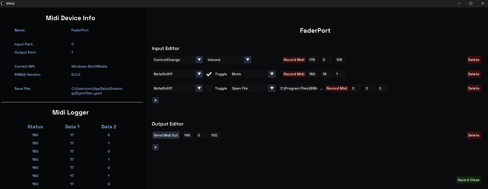

 

# IEMidi

**IEMidi** is a simple, open-source MIDI editor that leverages RtMidi for its MIDI message handling.  
The editor is designed to map any MIDI message to various actions such as volume control, mute, console commands or opening files.  
It also includes a MIDI logger for monitoring MIDI messages in real-time.

 

## Features
- **MIDI Map Editor**: Map MIDI messages to various actions like volume, mute, console commands, or opening files.
- **MIDI Logger**: Monitor and log MIDI messages in real-time for debugging and analysis.
- **Run in background**: Activate your MIDI device and keep the application running in the background.

## Third-Party Libraries Used
- [IECore](https://github.com/mozahzah/IECore.git)
- [IEActions](https://github.com/mozahzah/IEActions.git)
- [RtMidi](https://github.com/thestk/rtmidi)
- [Rapid YAML](https://github.com/biojppm/rapidyaml)

## Contribution
Contributors are welcomed to this open-source project. Any feedback or assistance, whether in coding, packaging, documentation, design, or testing, is greatly appreciated. 

## License
This work is licensed under the [SPDX-License-Identifier: GPL-2.0-only](./LICENSE).
