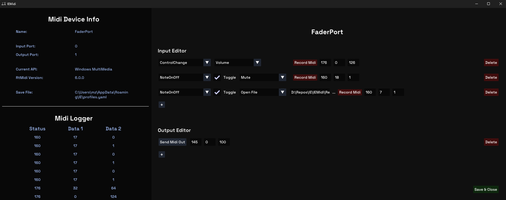

#  IEMidi

> Incus Entertainment's Solution to a MIDI Map Editor

**IEMidi** is a simple, open-source MIDI editor that leverages ImGui for the user interface and RtMidi for MIDI message handling.  
The editor is designed to map any MIDI message to various actions such as volume control, mute, console commands or opening files.  
It also includes a MIDI logger for monitoring MIDI messages in real-time.

## Features
- **MIDI Map Editor**: Map MIDI messages to various actions like volume, mute, console commands, or opening files.
- **MIDI Logger**: Monitor and log MIDI messages in real-time for debugging and analysis.
- **Run in background**: Activate your MIDI device and keep the application running in the background.

## Third-Party Libraries Used
- [Dear ImGui](https://github.com/ocornut/imgui)
- [RtMidi](https://github.com/thestk/rtmidi)
- [Rapid YAML](https://github.com/biojppm/rapidyaml)

## License
This project is licensed under the [GPL 2.0 License](./LICENSE).
